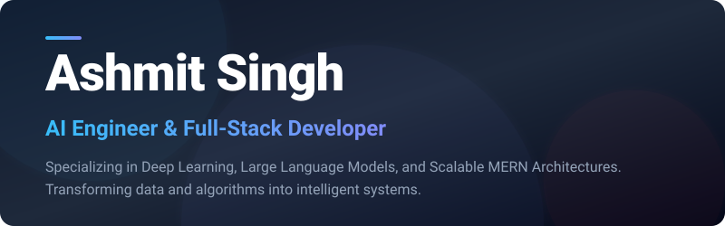

<div align="center">

  

  [](https://git.io/typing-svg)

  <p align="center">
    <strong>Bridging the gap between cutting-edge Artificial Intelligence and robust, full-stack web architectures.</strong>
  </p>

  <p align="center">
    <a href="https://github.com/ashmitsingh-ai"></a>
    <a href="https://github.com/ashmitsingh-ai"></a>
    <a href="mailto:ashmitsinghixh992006@gmail.com"></a>
    <a href="https://linkedin.com"></a>
  </p>

</div>

---

### 🧠 About Me

```yaml
name: Ashmit Singh
role: AI Engineer & Full-Stack Developer
focus_areas:
  - Deep Learning & Neural Networks (PyTorch, TensorFlow)
  - Large Language Models (LLMs) & Agentic Workflows
  - Full-Stack Web Development (MERN Stack, Solid.js)
  - High-performance Data Pipelines & Analytics
interests: ["Generative AI", "Scalable Systems", "Open Source", "Autonomous Agents"]
status: "Building intelligent systems that solve real-world challenges"
```

- 🔭 **Specialization:** Building end-to-end AI applications, from training & fine-tuning deep learning models to deploying scalable web interfaces.
- 🤖 **AI & ML Focus:** Hands-on experience with PyTorch, TensorFlow, Scikit-learn, LLMs, and computer vision / NLP pipelines.
- 🌐 **Full-Stack Craft:** Architecting seamless user experiences and performant APIs with the MERN stack (MongoDB, Express, React, Node.js) and modern reactive frameworks like Solid.js.
- ⚡ **Workflow & Tooling:** Supercharged by next-generation development environments including Google Antigravity, Cursor AI, and VS Code.
- 💬 **Ask me about:** Model optimization, neural networks, MERN architectures, database modeling, and agentic workflows!

---

### 🛠️ Tech Stack & Capabilities

<div align="center">

#### 🤖 Artificial Intelligence & Machine Learning


<br/>

#### 💻 Programming Languages


<br/>

#### 🌐 Web Development & Frameworks


<br/>

#### 🗄️ Databases & Cloud


<br/>

#### 🧰 Developer Tools & Workflow


</div>

---

### 📊 GitHub Activity & Analytics

<div align="center">
  <table border="0">
    <tr>
      <td width="50%">
        
      </td>
      <td width="50%">
        
      </td>
    </tr>
  </table>

  <br/>

  

  <br/><br/>

  

  <br/><br/>

  
</div>

---

### 🎯 Current Focus & Architecture Horizons

- 🧩 **Agentic Workflows & Multi-Agent Systems:** Designing autonomous LLM agents with specialized tools and memory systems.
- ⚡ **Model Fine-Tuning & Quantization:** Optimizing models for inference speed, lower memory footprints, and domain-specific tasks.
- 🚀 **Reactive Full-Stack Platforms:** Merging Solid.js & React frontends with real-time AI streaming endpoints.

---

### 🤝 Let's Connect & Collaborate

<div align="center">
  <a href="https://github.com/ashmitsingh-ai">
    
  </a>
  &nbsp;
  <a href="https://linkedin.com">
    
  </a>
  &nbsp;
  <a href="mailto:ashmitsinghixh992006@gmail.com">
    
  </a>
  &nbsp;
  <a href="https://x.com">
    
  </a>

  <br/><br/>
  
  <i>⭐️ From <a href="https://github.com/ashmitsingh-ai">ashmitsingh-ai</a> — "Transforming data and algorithms into impactful intelligent systems."</i>
</div>
